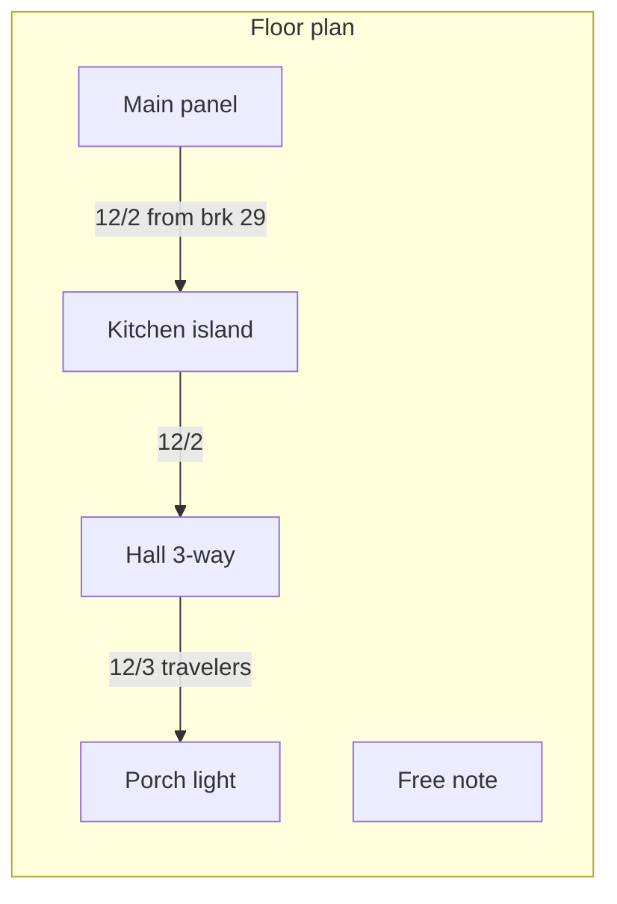

# Wire-it plan

## What this is

A documentation tool for real household NM (Romex) runs: which cable leaves a breaker, which labeled box it lands in, what device is in that box, and where it continues. It is not a circuit simulator and not an NEC checker.

The domain is a graph: locations are nodes, cables are typed edges. The engine is [xyflow](https://reactflow.dev/) so those runs stay real data (needed later for box internals). The feel should stay close to tldraw: information lives on the board — type plus your label on the cable, notes you drop wherever — not only in a side panel.

See [MILESTONES.md](./MILESTONES.md) for the numbered roadmap. See [MILESTONE-1-TWEAKS.md](./MILESTONE-1-TWEAKS.md) for the first round of editor changes after milestone 1. See [README.md](./README.md) to run the app and to host it.

## Stack

- Vite + React + TypeScript
- @xyflow/react for the canvas
- Zustand for diagram state
- Tailwind CSS
- Clerk for invite-only email/password login (OAuth later)
- Cloudflare Worker serves the SPA and `/api`
- Cloudflare D1 stores each user's drawings
- `localStorage` is a cache and the local-dev fallback
- JSON export/import; PNG export (light or dark)
- Vitest for domain helpers

Hosted at `wire.therobhenry.com`.

## Storage

A drawing is a versioned `Project` JSON object (locations, cables, notes). Export → JSON downloads that file. Import parses it and **adds a new drawing** (new id), so it does not overwrite the one you have open. PNG export is a picture, not a restore path.

**In the browser (milestone 1, and local-dev without Clerk):**

- `wire-it:library` — list of drawings plus the active id
- `wire-it:drawing:<id>` — the full JSON for that drawing

That data never leaves this browser. A different device, a cleared site, or a parse failure used to look like “the drawing vanished.” Loading no longer replaces an existing library with the sample kitchen.

**On the hosted app:**

- Clerk identifies the person (`userId`)
- D1 holds one row per drawing: `id`, `user_id`, `name`, `updated_at`, `project_json`
- Users only see their own rows
- Edits save to `localStorage` immediately and debounce a PUT to `/api/drawings/:id`
- First sign-in can upload whatever was already in this browser

## Milestone 1 — done

A working dark-mode editor you can run locally:

- Palette, canvas, and inspector
- Named, freely placed panels, boxes, fixtures, and notes
- Device types on boxes (outlet, GFCI, single-pole, 3-way, 4-way, light)
- Typed cables (`14/2` through `10/3`) between boxes; several cables can land on one box
- On-wire text repeats along the run: type always, plus an optional user label
- Orthogonal (90°) cable routes with draggable pressure points
- End labels at each box (`A1` / `To B2`) plus repeating type along the run
- Draw a cable by dragging from a node on one box to a node on another
- Wire color: default by gauge, plus a small palette
- Several local drawings (no account) with autosave
- Export / import JSON; export PNG in light or dark
- Sample “Kitchen lighting” drawing on first load

## Later (not built yet)

1. **Box internals** — zoom into a box; splice black / white / red / ground to terminals or wire-nuts
2. **Editor reliability** — remaining cable bugs; undo/redo
3. **OAuth** — Clerk social providers, same user id
4. **Light / dark mode** — in-app theme (PNG export already has light and dark)
5. **Custom colors** — user colors for wires, boxes, notes, and more
6. **Richer devices** — dimmer, fan, multi-gang boxes
7. **House context** — floor-plan underlay, rooms, multiple pages
8. **Share and print** — shareable JSON, print view
9. **More tldraw-like markup** — pen and non-cable arrows, if notes are not enough

## Data model (kept stable on purpose)

Project JSON is versioned so later box-internals and accounts can be added without breaking saved files. A cable catalog already lists conductors (`12/2` → black, white, ground) even though milestone 1 does not draw them.

On-wire text is `type` plus optional `label` (`12/2  from brk 29`). Breaker numbers live in the label, not a separate field.
