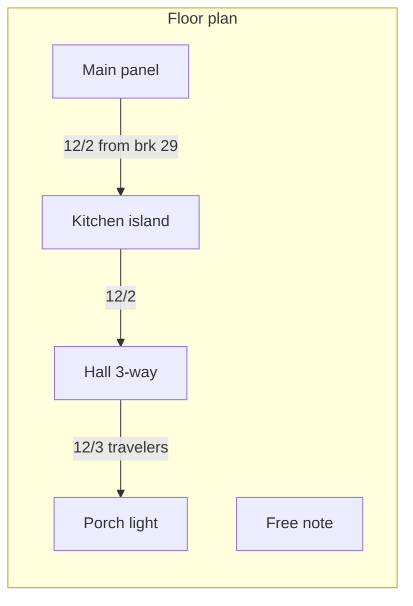

# Wire-it plan

## What this is

A documentation tool for real household NM (Romex) runs: which cable leaves a breaker, which labeled box it lands in, what device is in that box, and where it continues. It is not a circuit simulator and not an NEC checker.

The domain is a graph: locations are nodes, cables are typed edges. The engine is [xyflow](https://reactflow.dev/) so those runs stay real data (needed later for box internals). The feel should stay close to tldraw: information lives on the board — type plus your label on the cable, notes you drop wherever — not only in a side panel.

See [MILESTONES.md](./MILESTONES.md) for the numbered roadmap. See [README.md](./README.md) to run the app.

## Stack

- Vite + React + TypeScript
- @xyflow/react for the canvas
- Zustand for diagram state
- Tailwind CSS
- localStorage for drawings; JSON export/import; PNG export (light or dark)
- Vitest for domain helpers

No backend in milestone 1. Deploy later as a static site.

## Milestone 1 — done

A working dark-mode editor you can run locally:

- Palette, canvas, and inspector
- Named, freely placed panels, boxes, fixtures, and notes
- Device types on boxes (outlet, GFCI, single-pole, 3-way, 4-way, light)
- Typed cables (`14/2` through `10/3`) between boxes; several cables can land on one box
- On-wire text repeats along the run: type always, plus an optional user label
- Draggable bend points (double-click the cable to add a bend)
- Wire color: default by gauge, plus a small palette
- Several local drawings (no account) with autosave
- Export / import JSON; export PNG in light or dark
- Sample “Kitchen lighting” drawing on first load

## Later (not built yet)

1. **Box internals** — zoom into a box; splice black / white / red / ground to terminals or wire-nuts
2. **Drawings and accounts** — many drawings per user, under an account
3. **Light / dark mode** — in-app theme (PNG export already has light and dark)
4. **Custom colors** — user colors for wires, boxes, notes, and more
5. **Richer devices** — dimmer, fan, multi-gang boxes
6. **House context** — floor-plan underlay, rooms, multiple pages
7. **Share and deploy** — hosted site, shareable JSON, print view
8. **More tldraw-like markup** — pen and non-cable arrows, if notes are not enough

## Data model (kept stable on purpose)

Project JSON is versioned so later box-internals and accounts can be added without breaking saved files. A cable catalog already lists conductors (`12/2` → black, white, ground) even though milestone 1 does not draw them.

On-wire text is `type` plus optional `label` (`12/2  from brk 29`). Breaker numbers live in the label, not a separate field.
